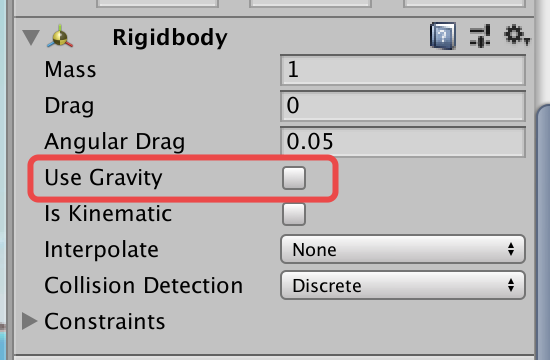

#### 改进飞碟（Hit UFO）游戏：

- 游戏规则：
  1. 游戏至少有三个 round（其实到round3就很容易死了。）
  2. 每个round内难度一样，但是不同round难度递增。
  3. 每个round中飞碟出现的位置是随机的。
  4. 鼠标点中得分，紫飞碟1分，绿飞碟3分，红飞碟5分。
  5. 每次游戏有6条命，少点一个掉一条命，没有命游戏结束。
- 游戏的要求：
  - 按 *adapter模式* 设计图修改飞碟游戏
  - 使它同时支持物理运动与运动学（变换）运动
- 扩展：
  - 用自定义组件定义几种飞碟，编辑并赋予飞碟一些属性，做成预制


**本次的改进主要是将游戏改成adapter模式，场景控制器通过adapter来用动作管理器飞出飞碟，并且增加了物理运动管理器**


##### Adapter模式

适配器主要用于接口的转换或者将接口不兼容的类对象组合在一起形成对外统一接口，是一种结构性模式，其本质是是一个中间件，适用于类及其对象。适配器主要用于接口的转换或者将接口不兼容的类对象组合在一起形成对外统一接口，是一种结构性模式，其本质是是一个中间件，适用于类及其对象。

按我自己通俗的理解，我们现在有一个圆形的孔和方形的钥匙，那明显是打不开的，所以我们需要一个东西，它能插进方的钥匙并且将方钥匙的开锁方法安在圆形钥匙上，那通过这个东西，我们就可以用方钥匙打开圆形孔。这个东西也就是适配器。

具体的适配器模式学习可以参考专业讲解该模式的博客。

##### AdapterManagerAdapter

首先定义adapter的接口。它定义了一个飞飞碟的方法，包括飞碟的种类，飞出角度，飞出的力度以及是否采用物理运动管理器。

```c#
public interface IActionManager
{
    void playDisk(GameObject disk, float angle, float power,bool isPhy);
}
```

然后在AdapterManagerAdapter中实现它。代码挺直观的，就不多解释了。

```c#
public class ActionManagerAdapter : MonoBehaviour,IActionManager
{
    public FlyActionManager action_manager;
    public PhysisFlyActionManager phy_action_manager;
    public void playDisk(GameObject disk, float angle, float power,bool isPhy)
    {
        if(isPhy)
        {
            phy_action_manager.UFOFly(disk, angle, power);
        }
        else
        {//上次实现的运动学动作管理器
            action_manager.UFOFly(disk, angle, power);
        }
    }
    // Use this for initialization
    void Start ()
    {
        action_manager = gameObject.AddComponent<FlyActionManager>() as FlyActionManager;
        phy_action_manager = gameObject.AddComponent<PhysisFlyActionManager>() as PhysisFlyActionManager;
    }

}
```


**上次我已经实现了运动学的动作管理器，运动的速度等直接用公式写出来，本次主要阐述物理学动作管理器的实现。**


##### PhysisUFOFlyAction

这个类是SSAction的实现，写了UFO做的动作，包括飞的速度、射出位置、射出角度的方法，以及动作结束的条件。当动作结束，飞碟会等待回收。在物理模式下，不需要定义物体向下的加速度，因为地球是有重力的，我们只需要给一个初速度即可。

```c#
public static UFOFlyAction GetSSAction(Vector3 direction, float angle, float power){
        //初始化物体将要运动的初速度向量
    PhysisUFOFlyAction action = CreateInstance<PhysisUFOFlyAction>();
    if (direction.x == -1) {
    		action.start_vector = Quaternion.Euler(new Vector3(0, 0, -angle)) * Vector3.left * power;
    }else{
        action.start_vector = Quaternion.Euler(new Vector3(0, 0, angle)) * Vector3.right * power;
    }
  	action.power = power;
    return action;
}
public override void Update(){
    //不需要了
}
public override void FixedUpdate(){
        //动作结束
		if (this.transform.position.y < -5) {
    		this.destroy = true;
        this.whoToNotify.SSActionEvent(this);
    }
}
public override void Start() {
        //使用重力以及给一个初速度
    gameobject.GetComponent<Rigidbody>().velocity = power / 35 * start_vector;
    gameobject.GetComponent<Rigidbody>().useGravity = true;
}
```

##### PhysisUFOFlyAtionManager

当场景控制器需要飞碟飞出来时，它会调用上面动作管理类的方法，来控制飞碟飞行。它们的关系可以理解为，飞碟能做的动作在动作管理类，但是飞碟要做什么是由这个控制器控制的，场景控制器决定飞碟在什么情况下动作。

因为我们现在用了适配器模式，所以不需要直接将动作管理器和场景管理器连在一起，通过适配器连接。

对FlyActionManager也要做同样的改动。

```c#
public PhysisUFOFlyAction fly;                            //飞碟飞行的动作
//public FirstController scene_controller; 					

protected void Start() {//没有了  
}
    //飞碟飞行
public void UFOFly(GameObject disk, float angle, float power) {
    fly = PhysisUFOFlyAction.GetSSAction(disk.GetComponent<DiskData>().direction, angle, power);
    this.RunAction(disk, fly, this);
}
```

##### SSAction

我们在这里新定义虚类fixedupdate。

```c#
		public virtual void FixedUpdate()
    {
        throw new System.NotImplementedException();
    }
```


##### SSActionManager

SSActionManager中原本只有运动学运动方法，现在要把物理学的加进去。这里需要注意Update和FixedUpdate的区别。Update()每一帧的时间不固定，即第一帧与第二帧的时间t1和第三帧与第四帧的时间t2不一定相同。不同设备表现也不一样。FixedUpdate()每帧与每帧之间相差的时间是固定的。所以物理属性的更新应该放在后者，这样GameObject的物理表现的更平滑，更接近现实。

```c#
protected void FixedUpdate(){
    foreach (SSAction ac in waitingAdd){
        actions[ac.GetInstanceID()] = ac;
    }
    waitingAdd.Clear();

    foreach (KeyValuePair<int, SSAction> kv in actions){
    		SSAction ac = kv.Value;
        if (ac.destroy){
            waitingDelete.Add(ac.GetInstanceID());
        }
        else if (ac.enable) {
                //物理运动更新
                ac.FixedUpdate();
        }
    }

    foreach (int key in waitingDelete) {
        SSAction ac = actions[key];
        actions.Remove(key);
        DestroyObject(ac);
    }
    waitingDelete.Clear();
}
```

##### FirstController

这是游戏的场景控制器，用来控制游戏场景。游戏有三个状态，分别是游戏开始、进行中和结束。用这三个状态来控制游戏对象的行为。

现在我们新加了物理运动，所以对它进行一些修改。之前的actionmanager直接用的是flyactionmanager，现在我们采用adapter。

```c#
		void Start ()
    {
        SSDirector director = SSDirector.GetInstance();     
        director.CurrentScenceController = this;             
        disk_factory = Singleton<DiskFactory>.Instance;
        score_recorder = Singleton<ScoreRecorder>.Instance;
      //action_manager = gameObject.AddComponent<FlyActionManager>() as ActionManager;
        action_manager = gameObject.AddComponent<ActionManagerAdapter>() as IActionManager;
        user_gui = gameObject.AddComponent<UserGUI>() as UserGUI;
    }
```

另外在飞出飞碟时需要加上isPhy属性。将isPhy设置为true，就是物理模式了。

```c#
		private void SendDisk()
    {
        float position_x = 16;                       
        if (disk_queue.Count != 0)
        {
            GameObject disk = disk_queue.Dequeue();
            disk_notshot.Add(disk);
            disk.SetActive(true);
            //设置被隐藏了或是新建的飞碟的位置
            float ran_y = Random.Range(0f, 15f);
            float ran_x = Random.Range(-1f, 1f) < 0 ? -1 : 1;
            disk.GetComponent<DiskData>().direction = new Vector3(ran_x, ran_y, 0);
            Vector3 position = new Vector3(-disk.GetComponent<DiskData>().direction.x * position_x, ran_y, 0);
            disk.transform.position = position;
            //设置飞碟初始所受的力和角度
            float power = Random.Range(10f, 15f);
            float angle = Random.Range(15f, 30f);
            //action_manager.UFOFly(disk,angle,power);
          	action_manager.playDisk(disk,angle,power,isPhy);
        }

        for (int i = 0; i < disk_notshot.Count; i++)
        {
            GameObject temp = disk_notshot[i];
            //飞碟飞出摄像机视野也没被打中
            if (temp.transform.position.y < -5 && temp.gameObject.activeSelf == true)
            {
                disk_factory.FreeDisk(disk_notshot[i]);
                disk_notshot.Remove(disk_notshot[i]);
                //玩家血量-1
                user_gui.ReduceBlood();
            }
        }
    }
```

##### Perfab

我们需要在之前的飞碟上加上rigidbody，让它们变成可以受力的刚性物体。



---

至此物理运动管理器就实现了，其实需要修改的部分很少，但是原理却大不一样，最终的游戏效果目测其实也没什么太大区别，但是它的性质是完全不一样的！


[项目仓库](https://github.com/anjahappy/3DGameHomework6.git)

[参考资料](https://blog.csdn.net/C486C/article/details/80052862)