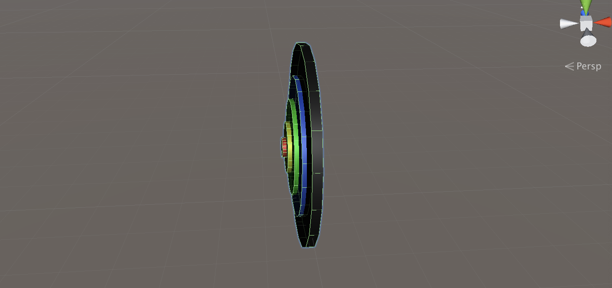
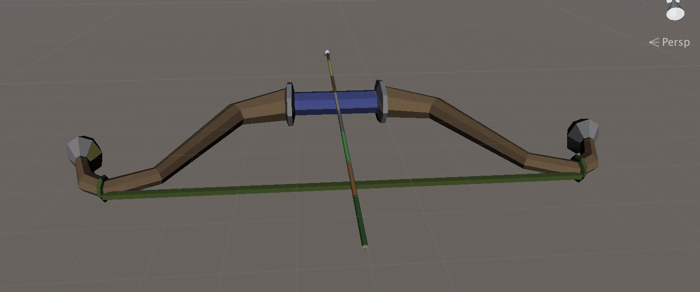

#### 打靶游戏

- 游戏内容要求：
  1. 靶对象为 5 环，按环计分；
  2. 箭对象，射中后要插在靶上
     - **增强要求**：射中后，箭对象产生颤抖效果，到下一次射击 或 1秒以后
  3. 游戏仅一轮，无限 trials；
     - **增强要求**：添加一个风向和强度标志，提高难度

- 规则：

  1. 一共有十只弓箭，射中最中间两环可以加一个箭。

  2. 最中间一环5分，最外围1分，依次递减。

  3. 弓箭射完游戏结束。

  4. 方向键控制弓的位置，回车发射箭。

  5. 风力随射箭数目增加增大。
  
      

##### 创建游戏对象

###### 箭靶

首先创建箭靶，用五个不同颜色的圆柱来做成预置。注意不能把它们完全套在一起，显示会错乱。



###### 弓箭

弓箭直接用下的预置。



##### UserGUI

界面上显示分数、弓箭数以及风向，和之前游戏的差不多，改了文字内容，就不赘述。

用键盘方向键和Enter键来控制弓箭和射箭。

```c#
	void Update()
    {
        if(game_start && !action.GetGameover())
        {//检测按下enter键
            if (Input.GetKeyDown(KeyCode.Return))
            {
                action.Shoot();
            }//检测方向键
            float translationY = Input.GetAxis("Vertical");
            float translationX = Input.GetAxis("Horizontal");
            //移动弓箭
            action.MoveBow(translationX, translationY);
        }
    }
```

##### FirstSceneController

在场景控制器中写了场景中的事件。首先是弓箭移动，用键盘操作，获得虚拟轴的值。

```c#
public void MoveBow(float offsetX, float offsetY) {
        //弓箭移动
        offsetY *= Time.deltaTime;
        offsetX *= Time.deltaTime;
        bow.transform.Translate(0, -offsetX, 0);
        bow.transform.Translate(0, 0, -offsetY);
    }
```

射击。

```c#
		public void Shoot() {
        if((!game_over || game_start))
        {
            arrow = arrow_factory.GetArrow();
            arrow_queue.Add(arrow);
            //风方向
            Vector3 wind = new Vector3(wind_directX, wind_directY, 0);
            //动作管理器实现箭飞行
            action_manager.ArrowFly(arrow, wind);
          	child_camera.GetComponent<ChildCamera>().StartShow();
            //用户能射出的箭数量减少
            recorder.arrow_number--;
            //场景中箭数量增加
            arrow_num++;
        }
    }
```

然后每支箭射出后，都要检查游戏当前的状态。is5是判断有没有射中最中间两环的bool函数。round越高，风吹的越厉害，游戏难度越大。最后是生成新的风向。

```c#
		public void CheckGamestatus() {
        if (recorder.arrow_number <= 0) {
            game_over =true;
            return;
        }else if (arrow_num >= recorder.target_arr)
        {
            round++;
            recorder.target_arr = targetarrow[round];
        }
         if (recorder.this_score >=4){
            recorder.arrow_number++;        
            is5=true;
         }else{
            is5 = false;
         }
        //生成新的风向
        wind_directX = Random.Range(-(round + 1), (round + 1));
        wind_directY = Random.Range(-(round + 1), (round + 1));
        CreateWind();//生成文本
    }
```

##### ArrowFlyActionManager

这里管理着箭飞行的动作，箭要受到风的影响。

```
public void ArrowFly(GameObject arrow,Vector3 wind)
    {
        fly = ArrowFlyAction.GetSSAction(wind);
        this.RunAction(arrow, fly, this);
    }
```

##### ArrowFlyAction

飞行的动作在这里。风的力量会使箭偏移，射中后会调用回调函数。

```c#
public override void FixedUpdate() {
        //风的力持续作用在箭身上
        this.gameobject.GetComponent<Rigidbody>().AddForce(wind, ForceMode.Force);

        //检测是否被击中或是超出边界
        if (this.transform.position.z > 30 || this.gameobject.tag == "hit")
        {
            this.destroy = true;
            this.callback.SSActionEvent(this,this.gameobject);
        }
    }
public override void Start()
    {
        gameobject.transform.parent = null;
        gameobject.GetComponent<Rigidbody>().velocity = Vector3.zero;
        gameobject.GetComponent<Rigidbody>().AddForce(force, ForceMode.Impulse);
    }
```

##### SSActionManager

```c#
	public void SSActionEvent(SSAction source, GameObject arrow = null) {
        //回调函数，如果是箭飞行动作做完，则做箭颤抖动作
        if(arrow != null)
        {
            ArrowTremble tremble = ArrowTremble.GetSSAction();
            this.RunAction(arrow, tremble, this);
        }
        else
        {
            //场景控制器减少一支箭
            FirstSceneController scene_controller = (FirstSceneController)SSDirector.GetInstance().CurrentScenceController;
            scene_controller.CheckGamestatus();
        }
    }
```

##### ArrowTremble

当箭射中靶后执行的颤抖动作。

```c#
public override void Update() {
        left_time -= Time.deltaTime;
        if (left_time <= 0)
        {
            //颤抖后回到初始位置
            transform.position = old_pos;
            this.destroy = true;
            this.callback.SSActionEvent(this);
        }

        // 弧度每次增加
        radian += per_radian;
        //y轴的位置变化,上下颤抖
        float dy = Mathf.Cos(radian) * radius; 
        transform.position = old_pos + new Vector3(0, dy, 0);
    }
```

##### CollisionDetection

当箭射出中靶子的时候，记分员会计分。

```c#
	void OnTriggerEnter(Collider arrow_head){ 
        //得到箭身
        Transform arrow = arrow_head.gameObject.transform.parent;
        if (arrow == null)
        {
            return;
        }
        if(arrow.tag == "arrow")
        {
            //箭身速度为0，不受物理影响
            arrow.GetComponent<Rigidbody>().velocity = new Vector3(0, 0, 0);
            arrow.GetComponent<Rigidbody>().isKinematic = true;
            recorder.Record(this.gameObject);
            //箭头消失
            arrow_head.gameObject.gameObject.SetActive(false); ;
            arrow.tag = "hit";
        }
    }
```

##### ArrowFactory&ScoreRecorder

这两个类一个是arrow的工厂，负责生产和回收箭，另一个是负责记录分数的。都和上一个游戏的方法几乎相同，不赘述。

##### ChildCamera

最后是加了一个副摄像机，摄像机跟随的是箭靶，只在箭射出后显示。

```c#
	void FixedUpdate() {
        Vector3 target = bow.transform.position + offset;
        //摄像机自身位置到目标位置平滑过渡
        transform.position = Vector3.Lerp(transform.position, target, smothing * Time.deltaTime);
    }
  void Update() {
        if (isShow)
        {
            leftTime -= Time.deltaTime;
            if (leftTime <= 0)
            {
                this.gameObject.SetActive(false);
                isShow = false;
            }
        }
    }
```

---

至此就基本完成了。整个游戏虽然功能比较简单，但是其实还挺复杂的。框架基本和之前一样都用的是MCV。参考学习了优秀博客，添加了一些自己的思考。完成还是挺快乐的。

[项目仓库](https://github.com/anjahappy/3DGameHomework6.git)

[参考资料](https://blog.csdn.net/C486C/article/details/80058316)